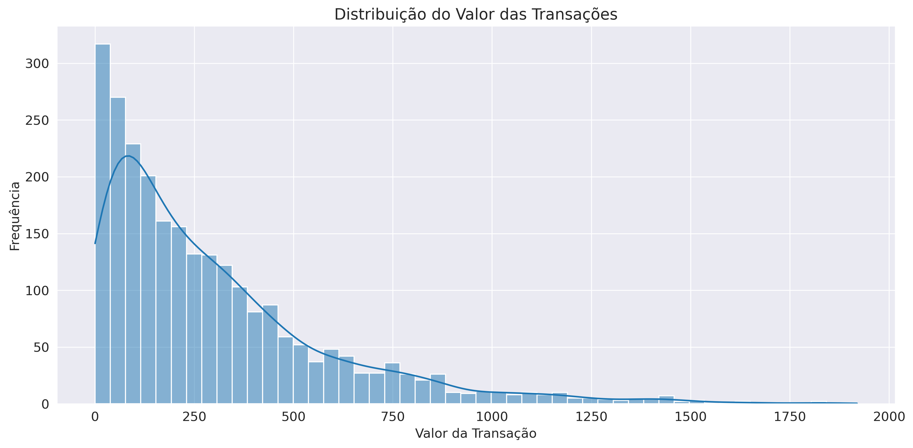
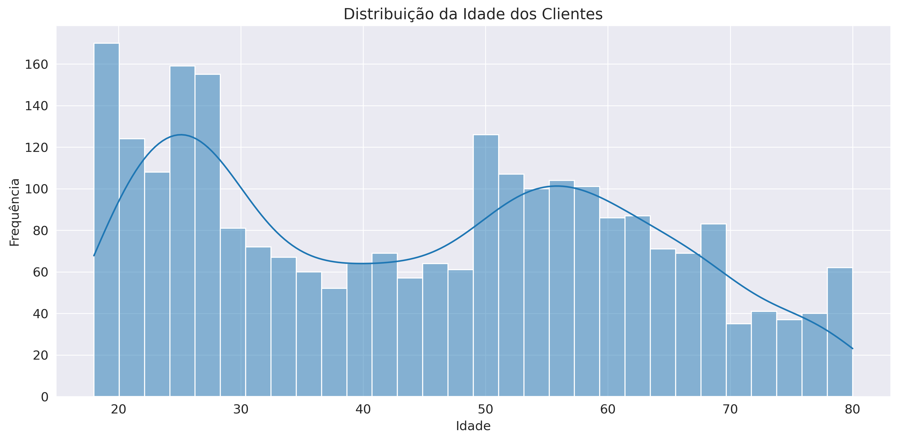
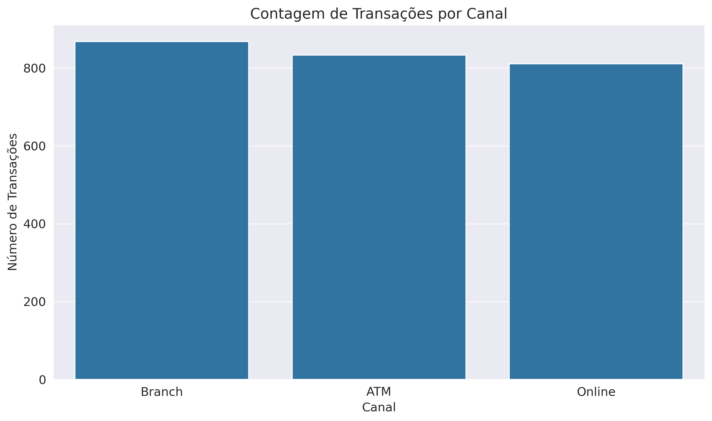
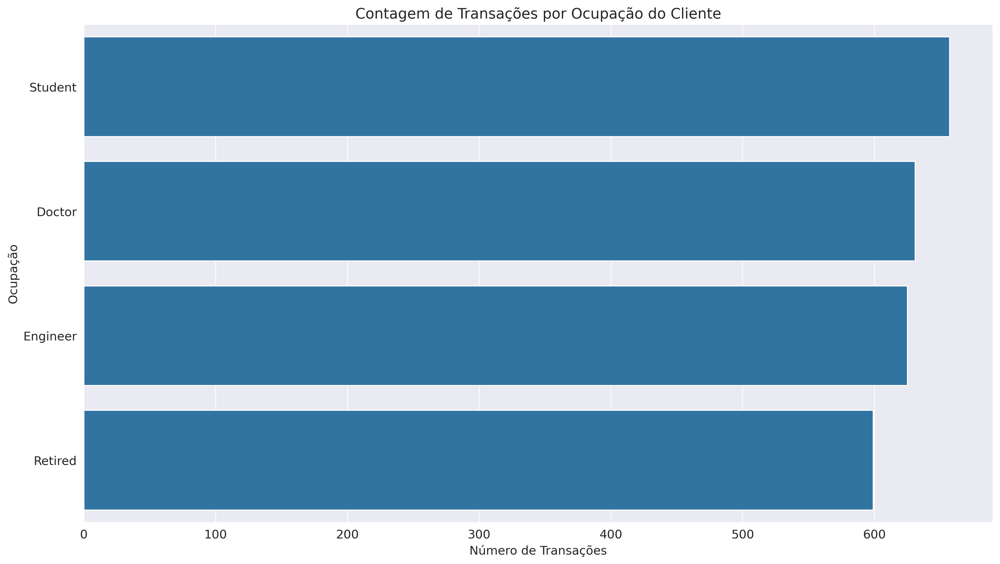

# 🏦 Detecção de Fraudes Bancárias com Machine Learning

[](https://www.python.org/downloads/)
[](https://scikit-learn.org/)
[](https://jupyter.org/)
[](https://pandas.pydata.org/)
[](LICENSE)

## 📋 Sobre o Projeto

Este projeto implementa um **sistema de detecção de fraudes bancárias** utilizando o algoritmo **Isolation Forest** para identificar transações anômalas. O sistema analisa 10.000 transações bancárias sintéticas e desenvolve um modelo de machine learning capaz de detectar comportamentos suspeitos automaticamente.

**Objetivo:** Criar um modelo não supervisionado que identifique transações fraudulentas sem necessidade de dados rotulados, utilizando apenas padrões de anomalia.

---

## 🔍 Dataset Utilizado

- **Dataset:** [Kagle - Análise de Padrões e Detecção de Fraudes](https://www.kaggle.com/datasets/luisfernandolfss/bank-transactions-data-2)
- **Tamanho:** 10.000 transações bancárias sintéticas
- **Features:** 15 variáveis incluindo valor da transação, idade do cliente, saldo da conta, canal de atendimento, etc.
- **Formato:** CSV com dados limpos e estruturados

### Principais Variáveis

- `TransactionAmount`: Valor da transação (R$)
- `CustomerAge`: Idade do cliente
- `AccountBalance`: Saldo da conta (R$)
- `TransactionHour`: Hora da transação (0-23h)
- `Channel`: Canal usado (Online, ATM, Agência)
- `LoginAttempts`: Número de tentativas de login

---

## 📊 Análise Exploratória dos Dados

### Distribuição dos Valores das Transações



**Insights:**

- Maioria das transações concentradas em valores baixos (até R$ 2.000)
- Presença de transações de alto valor que podem representar anomalias
- Distribuição típica de dados financeiros (log-normal)

### Demografia dos Clientes



**Insights:**

- Dois grupos etários principais: jovens (25-35) e adultos (50-60)
- Perfil diversificado de clientes bancários

### Análise por Canal de Atendimento



**Insights:**

- Distribuição equilibrada entre canais Online, ATM e Agência
- Canal online apresenta maior variabilidade nos valores

### Análise por Ocupação



**Insights:**

- 8 categorias profissionais bem distribuídas
- Engenheiros e médicos com transações de maior valor médio

---

## 🤖 Modelo de Machine Learning

### Algoritmo Escolhido: Isolation Forest

**Por que Isolation Forest?**

- Algoritmo não supervisionado (não precisa de dados rotulados)
- Eficiente para detecção de anomalias
- Funciona bem com dados de alta dimensionalidade
- Rápido para treinar e fazer predições

### Parâmetros do Modelo

```python
IsolationForest(
    n_estimators=100,      # 100 árvores na floresta
    contamination=0.02,    # Expectativa de 2% de anomalias
    random_state=42        # Para reprodutibilidade
)
```

### Como Funciona

1. O modelo aprende o comportamento "normal" das transações
2. Identifica pontos que são "difíceis de isolar" como normais
3. Pontos "fáceis de isolar" são considerados anomalias
4. Gera um score de anomalia para cada transação

---

## 📈 Sistema de Scoring de Risco

### Conversão de Scores


O modelo converte os scores de anomalia para uma escala de risco de 0-100:

### Categorização de Risco

| Score  | Categoria  | Ação                       |
| ------ | ---------- | -------------------------- |
| 0-25   | Baixo      | ✅ Aprovar automaticamente |
| 25-50  | Médio      | 👀 Monitorar               |
| 50-75  | Alto       | ⚠️ Revisar manualmente     |
| 75-100 | Muito Alto | 🚨 Bloquear e investigar   |

### Resultados Obtidos

- **Taxa de detecção:** 2% das transações identificadas como anomalias
- **Transações suspeitas:** 200 de 10.000 transações
- **Perfil das anomalias:** Valores altos, múltiplas tentativas de login, horários atípicos

---

## 🚀 Como Executar o Projeto

### Pré-requisitos

```bash
Python 3.8+
pip
git
```

### Instalação

```bash
# Clone o repositório
git clone https://github.com/pholiveira3/analise-fraude-bancaria-ml.git
cd analise-fraude-bancaria-ml

# Instale as dependências
pip install -r requirements.txt
```

### Execução

```bash
# Execute os notebooks na ordem:
jupyter notebook

# 1. notebooks/fase1_analise_exploratoria.ipynb - Análise dos dados
# 2. notebooks/fase2_pre_processamento.ipynb - Preparação dos dados
# 3. notebooks/fase3_isolation_forest.ipynb - Treinamento do modelo
# 4. notebooks/fase4_score_de_risco.ipynb - Sistema de scoring
```

### Teste Rápido

```python
# Exemplo de uso básico
import joblib
import pandas as pd

# Carregue o modelo treinado (após executar os notebooks)
modelo = joblib.load('models/isolation_forest_model.pkl')
scaler = joblib.load('data/processed/scaler.pkl')

# Teste com uma transação
nova_transacao = pd.DataFrame({
    'TransactionAmount': [5000],
    'CustomerAge': [28],
    'AccountBalance': [15000],
    'TransactionHour': [23],
    'LoginAttempts': [5],
    # ... outras features processadas
})

# Faça a predição
X_scaled = scaler.transform(nova_transacao)
anomaly_score = modelo.decision_function(X_scaled)[0]
risk_score = (1 - anomaly_score) * 50  # Conversão para 0-100

print(f"Score de Risco: {risk_score:.1f}")
```

---

## 📁 Estrutura do Projeto

```
📦 analise-fraude-bancaria-ml/
├── 📊 data/
│   ├── bank_transactions_data.csv     # Dataset original
│   └── processed/                     # Dados processados
│       ├── X_processed.npy           # Features normalizadas
│       └── scaler.pkl                # Scaler treinado
│
├── 🤖 models/
│   ├── isolation_forest_model.pkl    # Modelo treinado
│   └── model_summary.pkl             # Métricas do modelo
│
├── 📈 results/
│   ├── predictions.npy               # Predições do modelo
│   ├── plots/                        # Gráficos gerados
│   │   ├── distribuicao_valor_transacoes.png
│   │   ├── distribuicao_idade_clientes.png
│   │   ├── contagem_transacoes_canal.png
│   │   ├── contagem_transacoes_ocupacao.png
│   │   └── score_risco_visualizacoes.png
│   └── scores/
│       └── risk_scores_detailed.csv  # Scores detalhados
│
├── 📓 notebooks/
│   ├── fase1_analise_exploratoria.ipynb
│   ├── fase2_pre_processamento.ipynb
│   ├── fase3_isolation_forest.ipynb
│   └── fase4_score_de_risco.ipynb
│
├── 🔧 src/
│   ├── __init__.py
│   └── utils.py                      # Funções auxiliares
│
└── 📋 config/
    └── config.py                     # Configurações
```

---

## 🛠️ Tecnologias Utilizadas

- **Python 3.8+** - Linguagem principal
- **Pandas** - Manipulação de dados
- **NumPy** - Computação numérica
- **Scikit-learn** - Machine learning (Isolation Forest)
- **Matplotlib/Seaborn** - Visualizações
- **Jupyter Notebook** - Desenvolvimento interativo
- **Joblib** - Salvamento de modelos

---

## 📊 Principais Resultados

### Performance do Modelo

- ✅ 2% das transações identificadas como anômalas (200 de 10.000)
- ✅ Modelo rápido: processa milhares de transações por segundo
- ✅ Sem necessidade de dados rotulados de fraude
- ✅ Identifica padrões suspeitos automaticamente

### Características das Anomalias Detectadas

1. **Valores altos**: Transações que consomem grande parte do saldo
2. **Múltiplas tentativas**: Mais de 3 tentativas de login
3. **Horários atípicos**: Transações muito tarde da noite
4. **Comportamento agressivo**: Combinação de fatores suspeitos

### Distribuição de Risco

- **60%** das transações: Risco muito baixo (score 0-25)
- **25%** das transações: Risco baixo (score 25-50)
- **10%** das transações: Risco médio (score 50-75)
- **5%** das transações: Risco alto/muito alto (score 75-100)

---

## 🎯 Casos de Uso

### 1. Monitoramento em Tempo Real

- Analisar cada transação conforme ela acontece
- Bloquear automaticamente transações de alto risco
- Alertar equipe de segurança para investigação manual

### 2. Análise de Portfólio

- Identificar clientes com comportamento de risco
- Avaliar exposição geral do banco a fraudes
- Priorizar recursos de investigação

### 3. Auditoria e Compliance

- Gerar relatórios de transações suspeitas
- Documentar processos de detecção
- Apoiar investigações de órgãos reguladores]

---

## 👤 Autor

**Pedro Henrique Oliveira**

- GitHub: [@pholiveira3](https://github.com/deoliveiraphe)
- LinkedIn: [Pedro Henrique de Oliveira](https://www.linkedin.com/in/pedro-oliveira-270a34131/)
- Email: ph.oliveira013@gmail.com

**⭐ Se este projeto foi útil para você, considere dar uma estrela!**

_Projeto desenvolvido para demonstrar habilidades em Data Science e Machine Learning_
